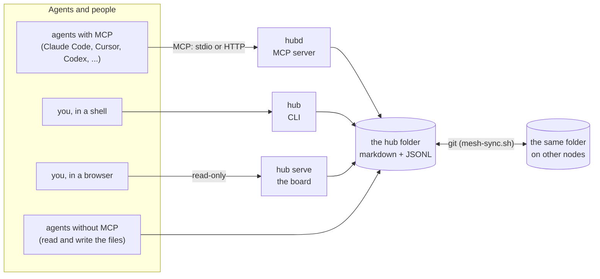
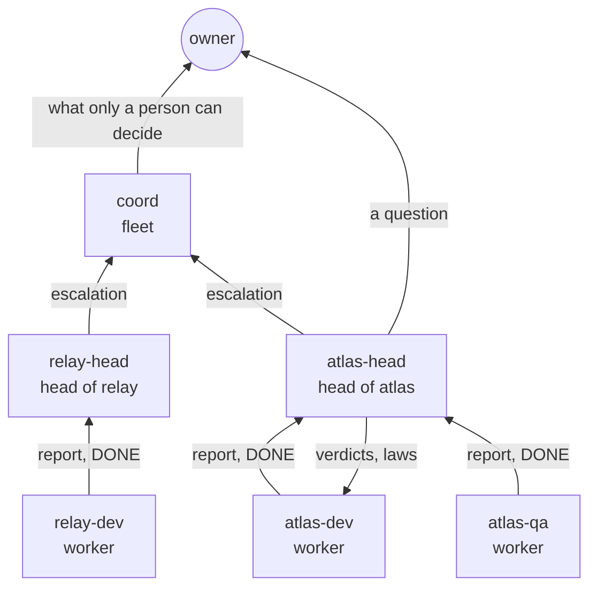
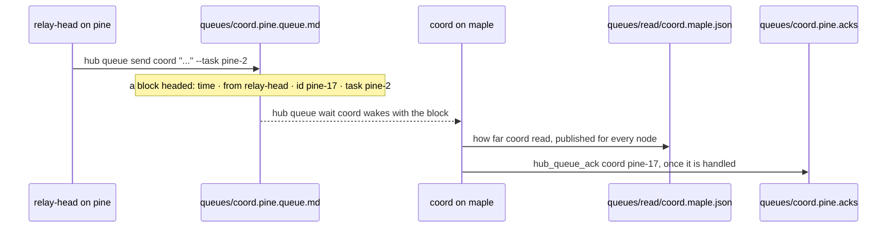
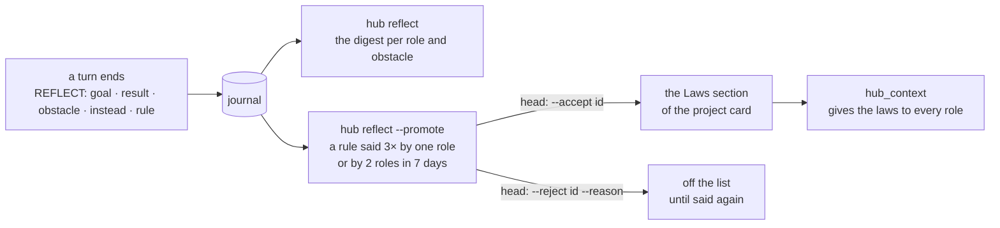

# Concepts — the parts of a hub, and how they fit

Every word the docs, the CLI and the tools use, in one place, with the file it lives in.
`hub demo` writes a hub that has one of each; the examples here are from it.

- [The picture](#the-picture)
- [Words](#words)
- [Who answers to whom](#who-answers-to-whom)
- [The life of a queue message](#the-life-of-a-queue-message)
- [From a reflection to a law](#from-a-reflection-to-a-law)
- [How each part works](#how-each-part-works)

## The picture

There is no database and no daemon you must keep running. `hubd` and `hub` are two
front ends to one folder; the board only reads it. With several machines, the folder is
a git repository and each machine is a node. A node appends its journal, its task events
and the queue messages it sends to files that bear its own name, so the logs merge
without conflict; a card, which any node may edit, merges by section once
`hub card merge-driver` is on.

## Words

| Word | What it is | Where it lives |
|---|---|---|
| **hub** | The folder that holds everything below. Data, not code: yours to keep, back up and grep. | `HUBD_DIR`, default `~/.hubd` |
| **team folder** | Where the team's rules and the queues are. Usually the hub itself; `HUBD_TEAM_DIR` names another. `hub doctor` says which one this shell would use. | `AGENTS.md`, `INBOX.md`, `queues/` |
| **node** | One machine writing into the hub, by name. | `HUBD_NODE`, default the hostname |
| **mesh** | The hub as a git repository that several nodes share. | `scripts/mesh-sync.sh`, or any git sync |
| **project card** | One file per project: a digest of a few lines of current state, then sections. A snapshot, not a log. | `projects/<slug>.md` |
| **section** | A part of a card, reached by key whatever its heading's language: `goal`, `next`, `facts`, `decisions`, `laws`, `owner-decisions`, ... | headings localised in `sections.json` |
| **journal** | What everyone did, one line each: time, project, author, kind, text. Append-only and attributed. | `journal.<node>.jsonl` |
| **report** | What an agent files at the end of a turn: `DECIDE:`, `FACT:`, `NEXT:`, `DONE:` ... lines that fan into the card's sections and the journal. | `hub report`, `hub_report` |
| **handoff** | Where one agent's work stands for whoever picks it up: its own `## Handoff <agent>` section of the card, replaced on each write, every earlier one kept in the journal. | `HANDOFF:` in a report; `hub_context`, `hub whereami` read it |
| **task** | Work with an id (`fir-1`), a project, an assignee, a deadline, what it depends on. Kept as events. | `tasks.<node>.events.jsonl` |
| **claim** | A soft lock on a path glob or a task, with a time to live. It informs; it never forbids. | `hub claim`, `hub_claim` |
| **queue** | A role's inbox: messages addressed to it, each a block with an id (`pine-17`). An agent waits on it without polling. | `queues/<role>.<node>.queue.md` |
| **read mark** | How far a role's reader got in each queue file, published so every node counts the same backlog. | `queues/read/<role>.<node>.json` |
| **resource** | A card for something that is not a project: a host, a vm, a service, an endpoint, a provider, a role. Typed `[[wikilink]]` edges between them. | `resources/<slug>.md` |
| **role** | A resource of type `role`: its rank, its project, its head. | `resources/atlas-dev.md` |
| **rank** | `worker` does the work; `head` runs a project's workers and rules on their work; `fleet` stands above the heads. | the role card |
| **owner** | A person whose decisions the agents wait for. Their queue messages and the tasks assigned to them are the owner's **buttons**. | `owner-roles.json` |
| **track** | A project with a head on record. The board shows each track: its roles, what is in work, blocked, closed. | |
| **verdict** | A head's journal entry that names a task and holds a verdict word (`ACCEPT`, `REJECT`). `hub stats` reads it as the outcome of an attempt. | the journal; `VERDICT:` in a report |
| **escalation** | A message with an id in a `fleet` role's queue. It waits on the board until the card of the fleet role's project quotes its key under Owner decisions. | the queue, the card |
| **presence** | Who is alive: a heartbeat per agent on its node, and one published list per node. | `presence/`, `presence.<node>.json` |
| **node snapshot** | What a node's own monitor says about it: sessions, disks, relays. hubd only reads it. | `snapshot.<node>.json` |
| **mail** | A file delivered from one role to another, reported as a journal line with its size and sha256. | journal kind `delivery` |
| **ledger** | What each session of a client spent, read from the client's own database: its role, models, tokens, the orders it read, the tasks it closed. `hub stats` binds it to tasks. | `ledger.<node>.jsonl`, `hub sessions ingest` |
| **reflection** | The end of a turn's report, as fields: goal, result, obstacle (a class from a fixed list), what to do instead, a proposed rule. | the report's `reflect` field |
| **candidate** | A rule said 3 times by one role, or by 2 roles, within 7 days. | `hub reflect --promote` |
| **law** | A candidate the head accepted: a line of the card's Laws section, given to every role of the project. | the card's `## Laws` |
| **AGENTS.md** | The team's own rules, yours to write. | the team folder |
| **INBOX.md** | Hand-off notes between sessions, newest on top, written by hand. | the team folder |
| **HUBD.md** | hubd's mechanics for agents, regenerated on each node from the installed version. Never synced. | the hub |
| **board** | `hub serve`: Summary, Tracks, Live, History. Read-only; its one button opens the rules. | `localhost:7777` |

## Who answers to whom

A worker hands work in; its head accepts or rejects it and rules on the rules its
workers propose. A head that cannot unblock its track escalates to a fleet role. The
owner sees, on one screen, only what waits for them: their queue, the tasks assigned to
them, the escalations nobody has answered.

## The life of a queue message

The file is append-only and has one writer, the node that sent. The send refuses a
message that is cargo (a file, a diff, base64) and a queue that holds too much already;
the queue of an owner or of a `fleet` role is never refused. Details:
[the queue invariant](queue-invariant.md).

## From a reflection to a law

## How each part works

- **Journal & structured reports** — an append-only team log you read with your
  eyes. At session end an agent files a `hub report` of prefix-tagged lines
  (`DECIDE: … | why`, `FACT:`, `COMM:`, `NEXT:`, `DONE: ids`, `HANDOFF:`) that fan into the project
  card's sections — structure in fields, not one prose blob. "What changed" is read
  from git, not retyped. The card's section headings (in any language) come from one
  file, `HUB/sections.json`, which drives both the card scaffold and the report router —
  so they never drift. A write reaches the section a card already has under any of its
  headings, so re-localising a hub never grows a second copy; `hub cards
  merge-sections` folds old doubles. A notifier follows the journal with
  `hub watch --as <name> --follow --json`: each new entry once, by a cursor that a mesh
  merge, a reset or a log rotation does not throw off. With `--exec <command>` each
  entry goes to the command and is marked only when it exits 0, so a failed delivery is
  retried ([interop](interop.md#following-the-journal-hub-watch);
  [contrib/watch-to-matrix.sh](../contrib/watch-to-matrix.sh) posts to a Matrix room).
- **Queues** — per-role message queues. Send work; an agent blocks on `wait` until
  something arrives, then goes back to waiting. No polling you, no prodding them. A
  queue has one live consumer by default — run a single waiting session per role.
  Roles listed in `<team>/subscriber-roles.json` fan out instead: every waiting session
  gets its own cursor and sees every message, keyed by a name that survives a restart
  (`HUBD_SUBSCRIBER` / `HUBD_SESSION` / `HUBD_AGENT`), so a respawned reader picks up
  where it left off. Crossing machines is a separate, replaceable concern:
  `scripts/mesh-sync.sh` moves the folder over git+ssh, and
  [mrgd](https://github.com/bzdOS/mrgd) can carry the same queues as Matrix room
  traffic — concurrently, on the same directory. See
  [interop → Transport](interop.md#transport-how-a-queue-crosses-machines), including
  how to check which of the two is actually enabled on a given node. In work mode
  (`hub queue wait <role> --tasks`) the queue is the role's own open, ready tasks:
  reading consumes nothing, starting is a claim with a TTL, and cancelling is closing
  the task — an order read by a turn that did nothing is never lost, and an order for a
  cancelled task never runs.
- **Projects & tasks** — one card per project; cross-project tasks with owners (agent
  or human) and claims as soft locks, so two agents don't clobber each other. `hub now`
  names the one task to do next and why it won; `hub agenda` splits the day by who can
  act; `hub plan` walks the dependency graph.
- **Roles, tracks, supervision** — a role is a resource card of type `role` (`rank`
  head / worker / fleet, a `head` link, its repo). A project with a head is a track.
  `hub board` puts every track on one screen for the owner — each role's state, what got
  done this week and why it was accepted, what is next, what waits for you. A role's
  rules come from one template per kind of role ([prompts/meta](../prompts/meta/README.md)):
  `hub prompts render worker --vars vars.json` writes them, `--check` says when a file
  drifted, and the MCP server serves the same render as prompts. `hub sense <head>`
  measures the head's workers and branches without a model and wakes the head only on
  an event; with no private patterns declared it passes no branch. A loop reports its
  state as heartbeat fields (`--state`, `--turn`, `--empty` ...), so nothing parses its
  wording.
- **Reflections** — a turn's report ends with a reflection: goal, result, obstacle (a
  class from a fixed list, plus the fact), what to do instead, and a proposed rule. It
  goes as the report's `reflect` field, checked against the lists, or as the `REFLECT`
  block in the text, read as written with what is off the lists named in the reply.
  `hub reflect --project 
` (MCP `hub_reflect`) counts them per role and per obstacle
  class, shows the latest facts and the rules more than one turn proposed, and lists a
  head's decisions on rules; `--json` keeps every key, so a script can read it. A head
  reads that digest instead of its workers' reports in full. A rule that only restates
  the prompt's own example is refused in the field, named a problem in the text, and
  counted apart, never as a rule. `hub recall` finds a rule or an obstacle as a hit of
  its own. One rule in other words counts as one: wordings that share 40% of their
  words (a word by its first five letters) are its variants. A rule said 3 times by one
  role, or by 2 roles, in 7 days is a candidate for the project's laws:
  `hub reflect --promote` lists them by id, and the head accepts or rejects each with
  `hub reflect --accept|--reject <id>`. An accepted one is a line in the card's Laws
  section, never rotated out, and `hub_context` returns the laws to every role of the
  project; a rejected one stays off the list until it is said again.
- **Resources & relationships** — infra is a card too: hosts, vms, services,
  endpoints, providers under `resources/`, with structured frontmatter (type, address,
  os, provider, status) and **typed `[[wikilink]]` edges** (`runs_on`, `depends_on`,
  `deploys_to`, `exposes`, `part_of`, ...). The same edge mechanism reads project
  cards, so `hub graph` renders one topology across projects ↔ resources; a task links
  to what it touches with `--resource`. Facts go in fields, not prose.
- **Board (read-only)** — `hub serve`: a Summary of each track, assembled by a script
  (goal, work in hand, blocked, closed today, the head's verdict on each task, what each
  role reports blocked; the escalations to the fleet still waiting for your answer; each
  node's sessions, disks and relays from its snapshot, what is wrong in red; the
  artifacts delivered to the track's roles), Tracks, a Live kanban with the mail
  relay's deliveries in a row of their own, and a History of the journal to play back.
  Cards move because agents move them. The only button is **⚙ Rules**, and it opens
  AGENTS.md. You don't manage the agents — you manage the rules.
- **Harvest** — one prompt turns any working dialog into project digests, tasks and
  logged decisions. Served as an MCP prompt (`harvest`) and `hub harvest`, so you invoke
  it straight from your client — no fetching the file. See [HARVEST.md](../HARVEST.md).
- **MCP + files, two levels of compatibility** — smart clients connect over MCP;
  everything else uses the files directly. If hubd is down, your data is still just
  markdown ([reading your hub with any tool](interop.md)).
- **Instructions that stay current** — your team rules live in `AGENTS.md` (yours to
  write); hubd's own mechanics live in `HUBD.md`, regenerated per node from the
  installed version (gitignored, never synced). Update the code → the next `hub`
  command that writes (or `hub upgrade`) refreshes `HUBD.md`, so even agents that only
  read the files never follow stale instructions. A command that only reads writes
  nothing to the hub.
