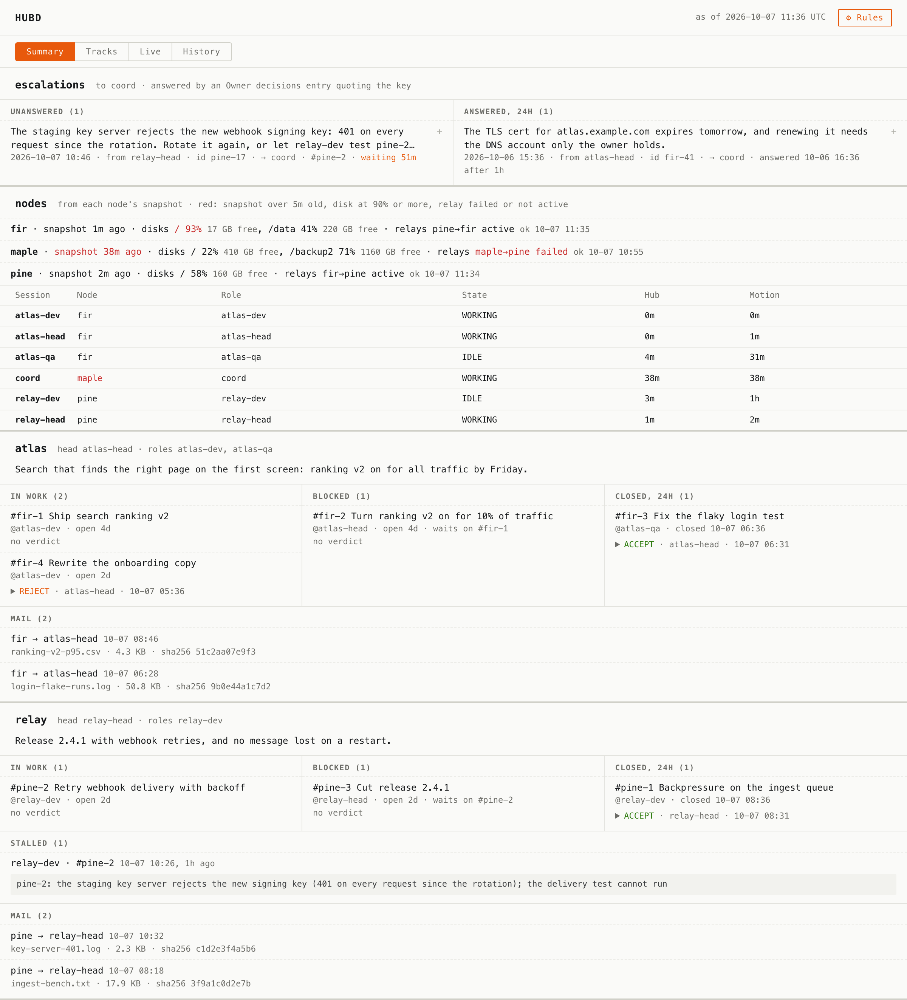
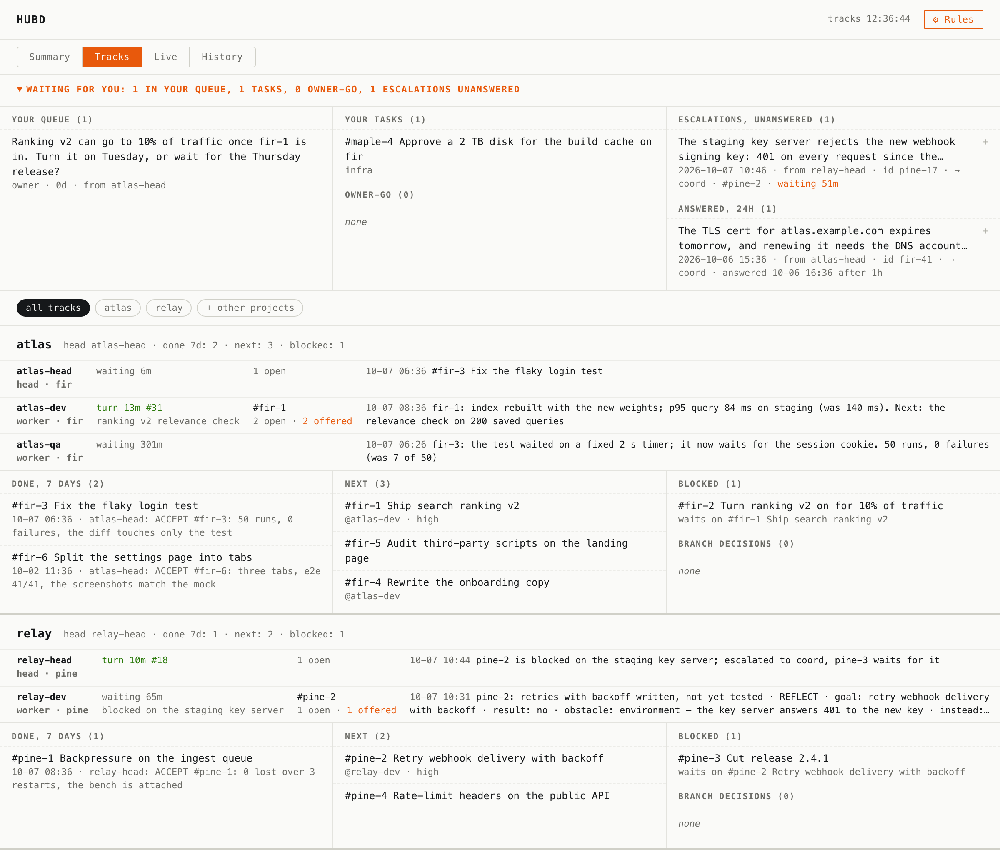

# 5. Roles — a team with heads, workers, and a board

**What you get.** Roles declared as cards: who heads a track, who works under whom,
who the escalations go to. From those cards hubd draws the board (each track, its
roles, what got done, what is next, what waits for you) and renders each role's rules
from one set of templates, so a rule changed once reaches every role.

Fifteen minutes. This continues [4. A second machine](4-second-machine.md) on `oak`.

```bash
export HUBD_DIR=/tmp/hub-tour HUBD_TEAM_DIR=/tmp/hub-tour HUBD_NODE=oak
cd /tmp/hub-tour-work
```

## Declare the roles

A role is a resource card of type `role`. Its `rank` says what it is: `head` for the
role that runs a project's track, nothing for a worker, `fleet` for the coordinator
above the heads. A `head` link says whom it answers to.

```bash
hub resource set head-shop --type role --attr rank=head --attr project=shop -m "runs the shop track: cuts tasks, dispatches, accepts by artifact" --by alice
hub resource set dev-shop --type role --attr project=shop --link head:head-shop -m "writes the shop's code" --by alice
hub resource set worker --type role --attr project=shop --link head:head-shop -m "load tests, key rotation, chores" --by alice
```

```text
Resource set: head-shop → /tmp/hub-tour/resources/head-shop.md
Resource set: dev-shop → /tmp/hub-tour/resources/dev-shop.md
Resource set: worker → /tmp/hub-tour/resources/worker.md
```

```bash
hub resource get head-shop
```

```text
---
kind: resource
type: role
rank: head
project: shop
---
# head-shop

- slug: head-shop
- set: 2026-10-07 13:02 by alice

## Digest

runs the shop track: cuts tasks, dispatches, accepts by artifact

← in:
   dev-shop —head→
   worker —head→
```

The card is the same markdown as a project card; the links are a graph you can
query (`hub graph`). A project with a head is a **track**.

## The board

Each role says it is alive (an agent does it with `hub_heartbeat` in its loop):

```bash
hub heartbeat head-shop --status waiting
hub heartbeat dev-shop --status working --task oak-2
hub heartbeat worker --status waiting
hub board
```

```text
Heartbeat: head-shop -> /tmp/hub-tour/presence/head-shop.json
Heartbeat: dev-shop -> /tmp/hub-tour/presence/dev-shop.json
Heartbeat: worker -> /tmp/hub-tour/presence/worker.json

── shop · head head-shop · done 7d 2 · next 4 · blocked 0
    ● head-shop         head   alive, seen 1m…               ·
    ● dev-shop          worker alive, seen 1m… #oak-2        10-07 12:59 queue full: reviewer holds 1 unread message(s), 82 bytes; a message f…
    ● worker            worker alive, seen 1m…               ·
  DONE (2)
    10-07 12:56  #oak-1  choose the payment provider  ← alice: #oak-1 choose the payment provider
    10-07 12:56  #oak-3  fix the 30 s checkout timeout on big carts  ← dev-shop: #oak-3 fix the 30 s checkout timeout on big carts
  NEXT (4)
    #oak-2  wire the hosted payment page into checkout
    #oak-4  load-test checkout with 200 items
    #oak-5  rotate the staging API key @worker
    #elm-1  write the refund policy page

── WAITING FOR YOU
  owner queue (1)
    alice  0d  from dev-shop #oak-2  APPROVE? Go live with PayCo on Friday. Staging: 200-item cart in 2 s, 0 errors …
```

One block per track: each role with its state, its task and its latest line; what was
done this week and by whom; what is next; what is blocked and on what. Below it, the
only part that is about you.

`hub serve` puts the same thing in a browser, read-only, on `localhost:7777`: the
Summary (every track on one screen), Tracks, Live (the journal as it happens) and
History. Its one button, ⚙ Rules, opens `AGENTS.md`: you manage the rules, not the
agents.

Two rows fill from outside hubd. A node whose own monitor writes `snapshot.<node>.json`
into the hub shows on the Summary with its sessions, disks and relays. A mail relay
that reports each file it delivers, `hub report "<sender> → <recipient>: <name> <bytes>
B sha256 <hex>" -k delivery -p <slug> --agent <relay>`, fills the Mail row of Live
and the recipient track's Mail on the Summary.



## Escalations

Above the heads sits a coordinator of rank `fleet`. Its project's card is where the
owner answers what the team cannot decide by itself:

```bash
hub card team -m "The team itself: who runs which track, and what the owner decided for all of them." --by alice
hub resource set coord --type role --attr rank=fleet --attr project=team -m "coordinates the heads; where escalations leave the team" --by alice
hub resource set head-shop --link head:coord --by alice
```

```text
Card set: team → /tmp/hub-tour/projects/team.md
Resource set: coord → /tmp/hub-tour/resources/coord.md
Resource set: head-shop → /tmp/hub-tour/resources/head-shop.md
```

A head that hits something above its pay grade sends it there:

```bash
hub queue send coord "PayCo wants a signed DPA before live keys. Sign it as is, or ask legal first?" --from head-shop
hub board
```

```text
→ coord.oak.queue.md delivered
…
── WAITING FOR YOU
  owner queue (1)
    alice  0d  from dev-shop #oak-2  APPROVE? Go live with PayCo on Friday. Staging: 200-item cart in 2 s, 0 errors …
  escalations to coord, unanswered (1)
    2026-10-07 13:02 · from head-shop · id oak-6  waiting 1m  PayCo wants a signed DPA before live keys. Sign it as is, or ask lega…
```

Every block with an id in a `fleet` role's queue is an escalation, and it waits, with
its age, until it is answered. Its key is the message's header line: the time, the
sender and the id, as the board shows it. The answer is an entry in the Owner
decisions of the fleet role's project card that quotes the key. Here the key is taken
from the board, so the command works as it stands:

```bash
KEY="$(hub board | grep -o '20[0-9-]* [0-9:]* · from head-shop · id oak-[0-9]*')"
hub section add team owner-decisions "answered $KEY — ask legal first; live keys wait for their yes" --by alice
hub board
```

```text
team → ## Owner decisions  (section created — check the name if you expected it to exist)
…
  answered in the last 24h (1)
    2026-10-07 13:02 · from head-shop · id oak-6  answered 10-07 13:03 after 1m  ask legal first; live keys wait for their yes
```

The answer lives on a card, so it is state, not a message: dated, attributed, and
still there next month for anyone who asks why.

## Rules, rendered per role

Each kind of role (worker, head, orchestrator) has a template in
[prompts/meta](../../prompts/meta/README.md), built from shared fragments; what belongs
to one role (its name, project, head, track goal, the owner's decisions) is passed in:

```bash
cat > worker-vars.json <<'EOF'
{"role": "worker", "kind": "claude-code", "project": "shop", "cwd": "/tmp/hub-tour-work/shop",
 "head": "head-shop", "allowed_paths": "  - src/\n  - tests/",
 "track_goal": "card payments live through PayCo's hosted page",
 "track_facts": "### Staging\n- a 200-item cart checks out in 2 s",
 "owner_decisions": "- PayCo's hosted page: no card data touches us",
 "base_ref": "origin/main", "private_patterns": "API keys, customer emails",
 "private_check": "git log -p origin/main.. | grep -nE 'sk_live_|@customer'"}
EOF
hub prompts render worker --vars worker-vars.json --out worker-rules.md
head -20 worker-rules.md
```

```text
# Worker `worker` (claude-code), project `shop`

You are a worker. Your head `head-shop` gives you work as a dispatch in your queue. You do not hand out dispatches,
do not review or describe other roles' work, and do not create tasks on the critical path: you report and you ask.

## Track goal
card payments live through PayCo's hosted page

## Track facts (refreshed by every render, never edited by hand)
### Staging
- a 200-item cart checks out in 2 s

## Owner decisions (do not dispute them, do not ask again)
- PayCo's hosted page: no card data touches us

## How you work
- Your task is the one a dispatch gave you or the one you claimed. Take it on as one step.
- The queue is empty and you have no task: one hub_report line "waiting for a dispatch from `head-shop`", end of turn.
- Before acting, ask whose work this unblocks. No answer: do not do it.
- Do not claim what you have not measured. "Done" only with a named artifact and the command that checks it.
```

The role reads the file; nobody edits it. A rule changes in the fragment, and the next
render carries it to every role. `--check` tells a loop when a role's file has gone
stale or was edited by hand. Edit one line by hand, then check:

```bash
sed -i.bak 's/2 s/3 s/' worker-rules.md
hub prompts render worker --vars worker-vars.json --check worker-rules.md
```

```text
worker-rules.md differs from the render of worker (- only in the file, + only in the render):
+11: - a 200-item cart checks out in 2 s
-11: - a 200-item cart checks out in 3 s
```

It exits 1. Over MCP the same templates are served as prompts (`prompts/list`,
`prompts/get`), so a client with no rules file gets the rules of the installed hubd.

## A whole team, to look at

Your practice hub has one track. A demo hub has a week of an invented team's work in
it: two tracks, six roles, three machines, an escalation answered and one waiting.

```bash
hub demo /tmp/hub-tour-demo
HUBD_DIR=/tmp/hub-tour-demo HUBD_TEAM_DIR=/tmp/hub-tour-demo hub board
```

```text
── atlas · head atlas-head · done 7d 2 · next 3 · blocked 1
    ● atlas-head        head   waiting 5m                    10-07 08:03 #fir-3 Fix the flaky login test
    ● atlas-dev         worker turn 12m #31    #fir-1        10-07 10:03 fir-1: index rebuilt with the new weights; p95 query 84 ms on staging…
    ● atlas-qa          worker waiting 300m                  10-07 07:53 fir-3: the test waited on a fixed 2 s timer; it now waits for the ses…
  DONE (2)
    10-07 08:03  #fir-3  Fix the flaky login test  ← atlas-head: ACCEPT #fir-3: 50 runs, 0 failures, the diff touches only t…
…
```

`hub demo` prints the other commands worth running against it, `hub serve` on its own
port among them. Your own hub is not read or written.



## What hubd refuses here, and why

**A rule with a hole in it.** Every variable a template declares is required; a blank
one would drop a fact, and the role could never know it had been there.

```bash
hub prompts render worker --vars '{"role": "worker", "project": "shop"}'
```

```text
Error: missing or blank variables for worker: kind, head, track_goal, track_facts, owner_decisions, cwd, allowed_paths, private_check, private_patterns, base_ref
```

It exits 2 and writes nothing, so a loop can tell stale rules (exit 1) from a render
that cannot happen.

**Guessing an answer.** An escalation is answered when an Owner decisions entry quotes
its exact key, and waits otherwise; `id oak-6` is not `id oak-60`. Nothing reads a
chat for an answer, and nothing times an escalation out.

**Refusing an escalation.** The one thing that is never refused: a `fleet` role's
queue takes every message, however full, so a team in trouble can always say so.

## What you have now

A team: tracks with heads, workers under them, a coordinator, rules from one source,
and a board that shows all of it and what waits for you. The full shape with several
heads is [Recipe 3](../recipes.md#3-orchestrator-and-a-fleet); the words are in
[Concepts](../concepts.md).

Next: [6. Laws](6-laws.md) — a team that learns from its own turns.
